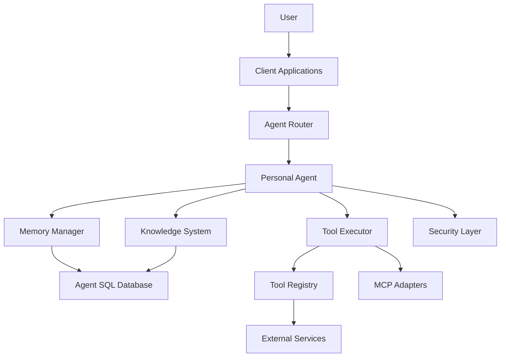
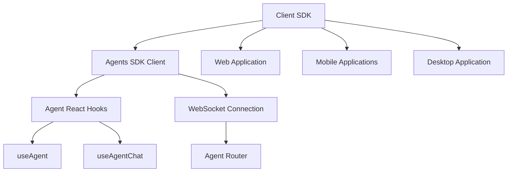
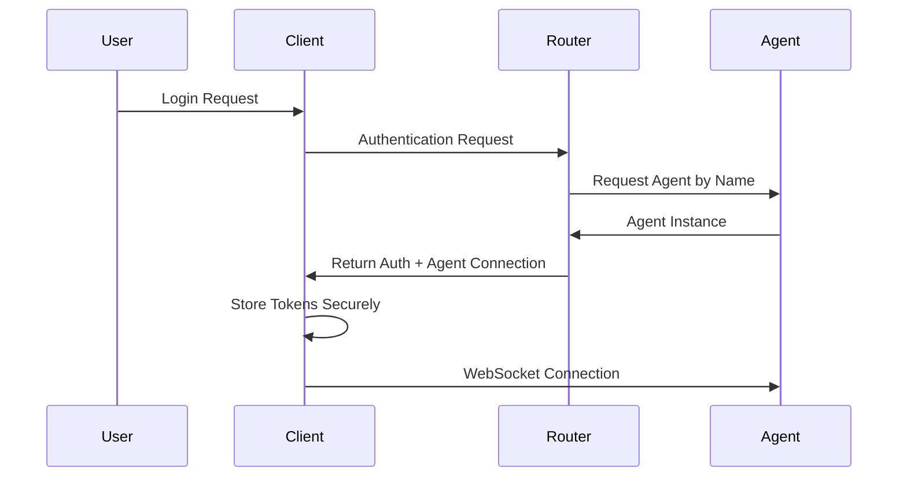

# ImpossibleAgent Project Map

This document describes the project structure and architecture of ImpossibleAgent, built on the Cloudflare Agents SDK.

## Project Architecture

ImpossibleAgent is built on the Cloudflare Agents SDK, leveraging its built-in state management, WebSocket communication, and tool integration capabilities. The architecture is organized around these key components:

1. **Core Agent Layer**: Extensions of the base Agent class for our specialized use cases
2. **Memory Extensions**: Enhanced memory capabilities built on the SDK's SQL database
3. **Tool Integration Framework**: MCP adapters and custom tools using the SDK's tool system
4. **Client SDK**: Extensions to the SDK's React hooks for cross-platform use
5. **Security Layer**: Additional encryption and privacy features beyond SDK defaults

## File Structure

```
impossibleagent/
├── src/                          # Source code
│   ├── index.ts                  # Main worker entry point
│   ├── config.ts                 # Configuration constants
│   ├── types.ts                  # Common TypeScript interfaces
│   ├── agents/                   # Agent implementations
│   │   ├── PersonalAgent.ts      # Core agent extending the Agent class ✅
│   │   ├── FamilyAgent.ts        # Family coordination agent 🔜
│   │   ├── WorkAgent.ts          # Professional context agent 🔜
│   ├── memory/                   # Memory extensions
│   │   ├── interfaces.ts         # Memory type definitions 🔜
│   │   ├── MemoryManager.ts      # Memory operations manager ✅
│   │   ├── EmbeddingManager.ts   # Embedding generation and retrieval ✅
│   │   ├── TemporalContextManager.ts # Time-based memory context ✅
│   │   ├── RelevanceRanking.ts   # Multi-factor memory relevance ✅
│   │   ├── LearningEnhancedMemoryRetrieval.ts # Memory retrieval with learning capabilities ✅
│   │   ├── episodicMemory.ts     # Event-based memory implementation 🔜
│   │   ├── semanticMemory.ts     # Knowledge-based memory implementation 🔜
│   │   ├── memoryIndex.ts        # Indexing for efficient retrieval 🔜
│   ├── tools/                    # Tool implementations
│   │   ├── interfaces.ts         # Tool type definitions 🔜
│   │   ├── BaseMCPAdapter.ts     # Common MCP functionality ✅
│   │   ├── CalendarAdapter.ts    # Calendar service adapter ✅
│   │   ├── EmailAdapter.ts       # Email service adapter ✅
│   │   ├── WeatherAdapter.ts     # Weather service adapter ✅
│   │   ├── DocumentStorageAdapter.ts # Document storage adapter ✅
│   │   ├── ToolDiscoveryManager.ts # Tool discovery and registry ✅
│   │   ├── ToolSuggestionSystem.ts # Context-aware tool suggestions ✅
│   │   ├── searchTools.ts        # Information retrieval tools 🔜
│   ├── knowledge/                # Knowledge management
│   │   ├── KnowledgeBase.ts      # Knowledge storage and retrieval ✅
│   │   ├── KnowledgeExtractor.ts # Extract knowledge from text ✅
│   │   ├── LearningSystem.ts     # Pattern recognition and feedback ✅
│   │   ├── preferences.ts        # Preference tracking 🔜
│   │   ├── KnowledgeGraph.ts     # Relationship mapping ✅
│   ├── security/                 # Enhanced security
│   │   ├── SecurityManager.ts    # Centralized security management ✅
│   │   ├── encryption.ts         # Data encryption 🔜
│   │   ├── accessControl.ts      # Permission management 🔜
│   │   ├── privacy.ts            # Privacy policy enforcement 🔜
│   │   ├── userControls.ts       # User memory management 🔜
│   ├── hooks/                    # React hooks
│   │   ├── useClickOutside.tsx   # Hook for detecting clicks outside a component ✅
│   │   ├── useMenuNavigation.tsx # Hook for keyboard navigation in menus ✅
│   │   ├── useTheme.ts           # Hook for theme management ✅
│   │   ├── useCrossDeviceSession.ts # Hook for cross-device session management ✅
│   │   ├── useSettingsSync.ts    # Hook for settings synchronization ✅
│   │   ├── useOfflineCapabilities.ts # Hook for offline capabilities ✅
│   ├── components/               # UI components
│   │   ├── memory-visualization/ # Memory visualization components
│   │   │   ├── MemoryVisualization.tsx # Force-directed memory graph ✅
│   ├── utils/                    # Utility functions
│   │   ├── logger.ts             # Logging utility 🔜
│   │   ├── validation.ts         # Input validation 🔜
│   │   ├── error.ts              # Error handling 🔜
├── test/                         # Test files
│   ├── unit/                     # Unit tests
│   │   ├── agents/               # Agent class tests 🔜
│   │   ├── memory/               # Memory extension tests 🔜
│   │   ├── tools/                # Tool integration tests 🔜
│   │   ├── knowledge/            # Knowledge system tests 🔜
│   │   ├── security/             # Security enhancement tests 🔜
│   ├── integration/              # Integration tests 🔜
│   ├── e2e/                      # End-to-end tests 🔜
├── clients/                      # Client implementations
│   ├── sdk/                      # Shared client SDK extensions 🔜
│   ├── web/                      # Web client using useAgent hook 🔜
│   ├── mobile/                   # Mobile client (React Native) 🔜
│   ├── desktop/                  # Desktop client (Electron) 🔜
```

Legend:
- ✅ Implemented and tested
- 🔜 Planned for implementation (see [ROADMAP.md](./ROADMAP.md))

## Module Relationships



## Implementation Status and Priorities

Current implementation status:

1. **Core Agent Layer**: ✅ Initial implementation complete
2. **Memory Extensions**: ✅ Basic implementation complete, enhancements ongoing
3. **Tool Integration Framework**: ✅ Basic implementation complete, expanding tools
4. **Client SDK**: ✅ Core hooks implemented, expanding capabilities
5. **Security Layer**: ✅ Basic implementation complete, enhancements planned

## Design Principles

1. **Leverage the Agents SDK**: Use built-in capabilities whenever possible, only extend when needed
2. **User-Centric Memory**: All memory organization prioritizes authentic personal recall
3. **Conversational Continuity**: Seamless experience across time, devices, and contexts
4. **Privacy by Design**: End-to-end encryption and user ownership of all data
5. **Progressive Familiarity**: Growing understanding of the user over time
6. **Interface Independence**: Core identity and memory separate from any particular interface
7. **Tool Integration Efficiency**: MCP-First approach to efficiently extend capabilities
8. **Do One Thing Well**: Each component focuses on a single responsibility

## Client Implementation Strategy

ImpossibleAgent requires a seamless experience across devices that maintains conversation continuity.

### Client Architecture



### Core Components

1. **Client SDK Extensions** (`src/hooks/`)
   - Extends the base Agents SDK client capabilities
   - Adds advanced state management for our use cases
   - Implements synchronized settings with `useSettingsSync`
   - Adds offline capability management with `useOfflineCapabilities`
   - Enables cross-device session management with `useCrossDeviceSession`

2. **Web Application** (`clients/web/`)
   - React application using Agents SDK React hooks
   - Built on the agents-starter template UI
   - Enhanced components for our specific features
   - Service workers for offline support

3. **Mobile Applications** (`clients/mobile/`)
   - React Native with SDK client integration
   - Native modules for OS integration
   - Background services for notifications
   - Voice integration with mobile assistants

4. **Desktop Application** (`clients/desktop/`)
   - Electron with SDK client integration
   - System tray integration
   - Global keyboard shortcuts
   - Deep OS integration

### Cross-Device Continuity

The client architecture ensures seamless experience transitions through:

1. **Agent State Synchronization**
   - Using the SDK's built-in state synchronization
   - Leveraging WebSocket connections managed by the SDK
   - Optimistic UI updates with conflict resolution
   - Agent addressing for consistent identity across devices

2. **Context Preservation**
   - Device context tracking in agent state
   - Persistent conversation history through agent storage
   - Intelligent resumption of interrupted sessions
   - Adaptive UI based on device capabilities

### Authentication Flow



### Session Management

The client maintains session continuity through:

1. **Agent-Based Sessions**
   - Consistent agent identity across devices using SDK naming
   - WebSocket connections managed by the SDK
   - Hibernation support for inactive sessions
   - Background sync for offline operations

2. **Context Transfer**
   - Agent state synchronization across devices
   - "Continue on device X" functionality
   - Responsive UI adaptation for new device capabilities
   - Preservation of conversation state in the agent

### Client-Side Privacy

1. **Local Processing**
   - Voice processing on-device when possible
   - Client-side encryption for sensitive data
   - Secure storage of authentication tokens
   - Minimized data transmission

2. **User Control**
   - Clear visibility into data being stored
   - Client-side controls for memory management
   - Offline mode options for privacy-sensitive situations
   - Transparency around tool permissions
