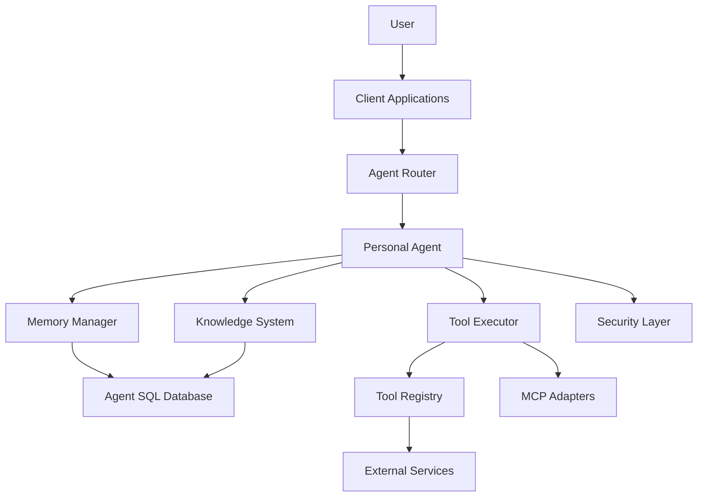

# ImpossibleAgent Project Overview

## Introduction

ImpossibleAgent is a powerful AI companion built on the Cloudflare Agents SDK, designed to provide a persistent, personalized assistant experience across devices and contexts. It features a sophisticated memory system, knowledge graph, tool integration framework, and security features that enable a truly personal AI experience.

## Key Features and Capabilities

- **Persistent Memory**: Long-term memory storage with episodic, semantic, and embedding-based components
- **Knowledge Graph**: Entity and relationship mapping with contradiction detection and resolution
- **Tool Integration**: MCP adapter pattern for connecting to external services
- **Cross-Device Continuity**: Seamless experience across different devices
- **Security System**: Access control, audit logging, and privacy settings
- **Offline Capabilities**: Functionality when disconnected from the network
- **Learning System**: Pattern recognition and adaptive behavior based on interactions
- **Tool Usage Tracking**: Analytics and improved suggestions based on usage patterns

## Architecture Overview

ImpossibleAgent is built on the Cloudflare Agents SDK, leveraging its built-in state management, WebSocket communication, and tool integration capabilities. The architecture is organized around these key components:



### Core Components

1. **PersonalAgent**: Extends the `AIChatAgent` class from the Agents SDK, providing the core functionality and integration with other components.

2. **Memory System**: Multi-layered memory system with:
   - Episodic memory for event-based storage
   - Semantic memory for factual knowledge
   - Embedding-based memory for semantic search
   - Temporal context awareness for time-based retrieval
   - Relevance ranking for multi-factor memory retrieval

3. **Knowledge System**:
   - Knowledge extraction from conversations
   - Knowledge graph for entity and relationship mapping
   - Learning system for pattern recognition and feedback
   - Contradiction detection and resolution

4. **Tool Integration**:
   - Tool discovery and registration
   - Context-aware tool suggestions
   - Tool execution framework
   - MCP adapter pattern for external service integration
   - Tool usage tracking and analytics

5. **Client Capabilities**:
   - Cross-device session management
   - Settings synchronization
   - Offline capabilities with IndexedDB storage
   - Memory visualization

6. **Security System**:
   - Access control with rule-based permissions
   - Comprehensive audit logging
   - Privacy settings management
   - Data retention and cleanup capabilities

## Project Structure

The project follows a modular structure with clear separation of concerns:

```
impossibleagent/
├── src/                          # Source code
│   ├── index.ts                  # Main worker entry point
│   ├── agents/                   # Agent implementations
│   │   ├── PersonalAgent.ts      # Core agent extending the Agent class
│   ├── memory/                   # Memory extensions
│   │   ├── MemoryManager.ts      # Memory operations manager
│   │   ├── EmbeddingManager.ts   # Embedding generation and retrieval
│   │   ├── TemporalContextManager.ts # Time-based memory context
│   │   ├── RelevanceRanking.ts   # Multi-factor memory relevance
│   │   ├── LearningEnhancedMemoryRetrieval.ts # Memory retrieval with learning
│   ├── tools/                    # Tool implementations
│   │   ├── BaseMCPAdapter.ts     # Common MCP functionality
│   │   ├── CalendarAdapter.ts    # Calendar service adapter
│   │   ├── EmailAdapter.ts       # Email service adapter
│   │   ├── WeatherAdapter.ts     # Weather service adapter
│   │   ├── DocumentStorageAdapter.ts # Document storage adapter
│   │   ├── ToolDiscoveryManager.ts # Tool discovery and registry
│   │   ├── ToolSuggestionSystem.ts # Context-aware tool suggestions
│   │   ├── ToolUsageTracker.ts   # Tool usage analytics and tracking
│   ├── knowledge/                # Knowledge management
│   │   ├── KnowledgeBase.ts      # Knowledge storage and retrieval
│   │   ├── KnowledgeExtractor.ts # Extract knowledge from text
│   │   ├── LearningSystem.ts     # Pattern recognition and feedback
│   │   ├── KnowledgeGraph.ts     # Relationship mapping
│   ├── security/                 # Enhanced security
│   │   ├── SecurityManager.ts    # Centralized security management
│   ├── hooks/                    # React hooks
│   │   ├── useCrossDeviceSession.ts # Cross-device session management
│   │   ├── useSettingsSync.ts    # Settings synchronization
│   │   ├── useOfflineCapabilities.ts # Offline capabilities
│   ├── components/               # UI components
│   │   ├── memory-visualization/ # Memory visualization components
```

## Current Status and Implementation Progress

### Fully Implemented and Integrated Components

- ✅ **Core Agent Layer**: `PersonalAgent` class extending `AIChatAgent` from the Agents SDK
- ✅ **Memory System**: Episodic, semantic, and embedding-based memory with temporal context and relevance ranking
- ✅ **Knowledge System**: Knowledge extraction, knowledge graph, and learning system
- ✅ **Tool Integration**: MCP adapters, tool discovery, suggestion, and usage tracking
- ✅ **Security System**: Access control, audit logging, and privacy settings
- ✅ **Client Hooks**: Cross-device session management, settings synchronization, and offline capabilities

### In Development

- 🔜 **Advanced UI Components**: Specialized UI components for different interaction modes
- 🔜 **Security Enhancements**: Advanced access control and comprehensive audit logging
- 🔜 **Additional MCP Adapters**: Adapters for more external services
- 🔜 **Advanced Learning Mechanisms**: More sophisticated algorithms for the learning system
- 🔜 **Tool Chaining**: Tool chaining for complex workflows

### Current Focus Areas

1. **Advanced UI Components** (Target: June 15, 2025):
   - Tool usage analytics dashboard
   - Tool suggestion UI with parameter input forms
   - Voice interaction components
   - Rich media messaging components
   - Enhanced memory visualization

2. **Security Enhancements** (Target: July 10, 2025):
   - Advanced access control mechanisms
   - Comprehensive audit logging
   - Enhanced privacy settings management
   - Data encryption for sensitive information
   - User authentication improvements

3. **MCP Adapter Expansion** (Target: August 5, 2025):
   - Productivity tool adapters (document editing, task management)
   - Social media platform adapters (Twitter, LinkedIn, Facebook)
   - Smart home device adapters (IoT integration)
   - Calendar and scheduling adapters (beyond basic implementation)
   - Email and communication adapters (enhanced capabilities)

## Development Guide

### Key Implementation Patterns

1. **Leverage the Agents SDK**:
   - Use built-in SDK capabilities whenever possible
   - Extend SDK classes rather than building from scratch
   - Follow SDK patterns for WebSockets, state management, and tools

2. **Memory Management Principles**:
   - Leverage the Agents SDK's built-in SQL database (`this.sql`)
   - Use the state management system (`this.setState`, `this.state`)
   - Keep raw memory separate from processed insights
   - Follow the patterns established in the `MemoryManager` class

3. **Tool Integration Principles**:
   - Use the Agents SDK tool system for defining and executing tools
   - Follow the MCP-First approach - prefer external services via MCP adapters
   - Implement tools with both automatic execution and confirmation patterns
   - Extend the `BaseMCPAdapter` class for new service integrations

### Development Process

1. **Feature Planning**:
   - Check the roadmap to ensure alignment with project priorities
   - Create an issue describing the feature or bug
   - Design interfaces and data flows before implementation
   - Discuss complex changes with maintainers

2. **Testing & Validation Strategy**:
   - Follow the testing pyramid approach (unit, integration, E2E tests)
   - Aim for >85% test coverage for core business logic
   - Write tests before implementation for critical components (test-first development)
   - Use Vitest for unit and integration testing
   - Implement proper mocking strategies for dependencies
   - Run tests automatically on every commit via CI
   - Prioritize coverage for critical components (memory system, knowledge graph, tool integration)

3. **Implementation Guidelines**:
   - Follow test-driven development with Vitest
   - Organize code with one responsibility per file
   - Define clear interfaces for module boundaries
   - Minimize coupling between modules
   - Include comprehensive comments explaining the "why"
   - Follow established patterns in existing implementations

3. **Pull Request Process**:
   - Create a branch using the format `feature/feature-name` or `fix/issue-description`
   - Keep changes focused on a single feature or fix
   - Update relevant documentation
   - Ensure all tests pass before submitting
   - Include a clear description of changes and reference related issues
   - Get at least one code review
   - Squash and merge to the target branch

## Frontend Development Approach

ImpossibleAgent follows a phased approach to frontend development, leveraging the Cloudflare Agents SDK's client capabilities.

### Development Principles

1. **SDK-First Development**: Maximize use of Agents SDK client libraries and React hooks
2. **Progressive Enhancement**: Start with essential functionality and progressively add advanced features
3. **Cross-Platform from Day One**: Use the SDK's core client capabilities across platforms
4. **Consistency First**: Establish design system and interaction patterns early
5. **User Experience Priority**: Prioritize features that showcase the unique memory and continuity capabilities

### Phased Approach

1. **Phase 1: Core SDK & Conversation Interface**
   - Client SDK foundation using `agents/react` and `useAgent` hook
   - Web application with basic conversation UI
   - Authentication integrated with agent routing
   - Local storage for offline capabilities
   - Settings management interface

2. **Phase 2: Tool Integration & Context Management**
   - Tool suggestion and execution UI
   - Parameter input forms for tools requiring confirmation
   - Tool execution status indicators and result visualization
   - OAuth flows for connecting external services
   - Context-aware UI adaptations and memory reference components

3. **Phase 3: Multi-Device Experience**
   - Mobile application with React Native and Agents SDK client
   - Desktop application with Electron and Agents SDK client
   - Cross-device session continuity
   - Synchronized notification management
   - Device-aware response formatting

4. **Phase 4: Advanced Interaction & Personalization**
   - Voice interaction capabilities
   - Rich media messaging components
   - Memory visualization components
   - Preference management UI
   - Personal data insights dashboard

5. **Phase 5: Production Refinement & Performance**
   - Comprehensive error handling
   - Graceful degradation strategies
   - Cross-browser/device testing
   - Accessibility compliance
   - Performance optimization

## Future Development Plans

### Short-Term Goals (Next 3 Months)

1. **Advanced UI Components**:
   - Create specialized UI components for different interaction modes
   - Implement tool usage analytics dashboard
   - Build tool suggestion UI with parameter input forms
   - Develop voice interaction components
   - Enhance memory visualization components

2. **Security Enhancements**:
   - Implement advanced access control mechanisms
   - Create comprehensive audit logging
   - Enhance privacy settings management
   - Add data encryption for sensitive information
   - Implement secure authentication flows

3. **MCP Adapter Expansion**:
   - Implement productivity tool adapters
   - Create social media platform adapters
   - Develop smart home device adapters
   - Enhance calendar and scheduling adapters
   - Improve email and communication adapters

### Medium-Term Goals (3-6 Months)

1. **Advanced Learning Mechanisms**:
   - Enhance the LearningSystem with more sophisticated algorithms
   - Implement reinforcement learning for tool selection
   - Develop more advanced pattern recognition
   - Create feedback loops for continuous improvement
   - Add personalized learning models

2. **Tool Chaining**:
   - Implement tool chaining for complex workflows
   - Create templates for common tool chains
   - Develop automatic tool chain suggestion
   - Build tool chain execution engine
   - Add tool chain visualization

3. **Multi-Platform Implementation**:
   - Create web client using SDK's React hooks
   - Build mobile applications with SDK client integration
   - Develop desktop applications with system integration
   - Add voice interface capabilities
   - Implement cross-device continuity

### Long-Term Vision (6+ Months)

1. **Advanced Memory Features**:
   - Implement advanced memory consolidation algorithms
   - Add emotional context and sentiment tracking
   - Create memory importance ranking
   - Implement cross-user memory boundaries
   - Build collective knowledge with privacy guarantees

2. **Advanced Interaction Capabilities**:
   - Create multi-session conversation threading
   - Implement contextual proactive suggestions
   - Add communication style adaptation
   - Build user-specific vocabulary learning
   - Develop personalized coaching capabilities

3. **Ecosystem Integration**:
   - Create enhanced calendar and task management
   - Build document and knowledge base connections
   - Add broader API integrations
   - Implement IoT device awareness and control
   - Create physical world context awareness

## Getting Started

### Prerequisites

- Node.js 18+
- npm or yarn
- Cloudflare account (for deployment)
- OpenAI API key (for development)

### Development Environment Setup

1. **Clone the repository**:
   ```bash
   git clone https://github.com/your-org/impossibleagent.git
   cd impossibleagent
   npm install
   ```

2. **Configure Wrangler** (for Cloudflare Workers):
   ```bash
   npx wrangler login
   ```

3. **Set up environment variables**:
   Create a `.dev.vars` file in the project root:
   ```
   OPENAI_API_KEY=your_development_api_key
   # Add any other needed variables
   ```

4. **Run the development server**:
   ```bash
   npm run dev
   ```
   This will start a local server at http://localhost:8787 with hot reloading enabled.

### Project Configuration

The project uses a comprehensive development environment with the following components:

1. **TypeScript Configuration**:
   - Target: ES2021
   - Module: ES2022
   - Module Resolution: Bundler
   - Strict type checking enabled
   - Path aliases configured for clean imports

2. **Build Configuration**:
   - Vite as the build tool
   - Cloudflare Workers plugin for edge deployment
   - React plugin for JSX support
   - TailwindCSS for styling

3. **Wrangler Configuration**:
   - Worker name: agents-starter
   - Entry point: src/server.ts
   - Compatibility date: 2025-02-04
   - Node.js compatibility flags enabled
   - Durable Objects for state management
   - SQLite migrations configured

4. **Package Scripts**:
   - `start`: Run development server on port 8080
   - `deploy`: Build and deploy to Cloudflare
   - `test`: Run tests with Vitest
   - `types`: Generate Wrangler types
   - `format`: Format code with Prettier
   - `check`: Run linting and type checking

## Resources and Links

- [Cloudflare Agents SDK Documentation](https://developers.cloudflare.com/agents/)
- [Project Repository](https://github.com/your-org/impossibleagent)
- [Cloudflare Workers Documentation](https://developers.cloudflare.com/workers/)
- [OpenAI API Documentation](https://platform.openai.com/docs/api-reference)
- [Vite Documentation](https://vitejs.dev/guide/)
- [TailwindCSS Documentation](https://tailwindcss.com/docs)
