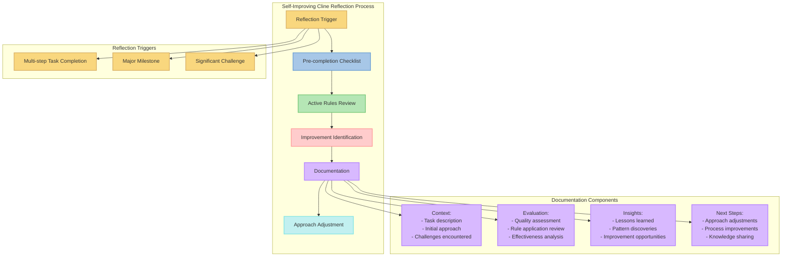
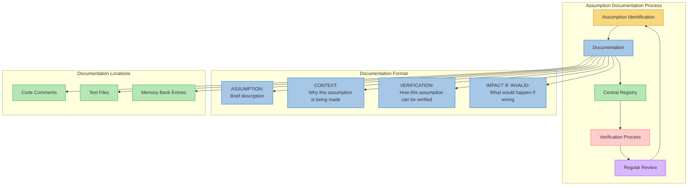
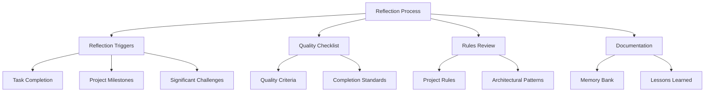
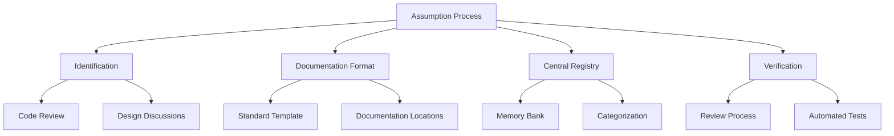

# ImpossibleAgent Contextual Awareness Patterns

This document describes the patterns implemented for improving contextual awareness and self-improvement in the ImpossibleAgent project.

## Self-Improving Cline Reflection Pattern

### Pattern Description
The Self-Improving Cline Reflection Pattern is a structured approach to continuous improvement through systematic reflection at key development milestones. It provides a framework for evaluating work quality, identifying improvement opportunities, and documenting lessons learned.

### Implementation Pattern


### Rationale
1. **Continuous Improvement**: Formal reflection processes improve development quality and consistency over time.
2. **Knowledge Transfer**: Documented reflections ensure insights are preserved between development sessions.
3. **Pattern Recognition**: Regular reflection helps identify recurring patterns and optimization opportunities.
4. **Quality Assurance**: Pre-completion checklists ensure consistent quality standards.
5. **Rule Adherence**: Active rules review ensures consistent application of project guidelines.

### Benefits
1. **Higher Quality Deliverables**: Systematic reflection leads to improved output quality.
2. **Consistent Practices**: Regular review of rules ensures consistent application of best practices.
3. **Knowledge Preservation**: Documentation of insights prevents knowledge loss between sessions.
4. **Accelerated Learning**: Structured reflection accelerates the learning process.
5. **Reduced Technical Debt**: Early identification of issues prevents accumulation of technical debt.

### Implementation Details
1. **Reflection Process**:
   - Pre-completion checklist of quality criteria
   - Review of active rules and their application
   - Identification of improvement opportunities
   - Documentation of lessons learned
   - Adjustment of approach for future tasks

2. **Timing**:
   - Before completing multi-step tasks
   - At major project milestones
   - After encountering significant challenges

3. **Documentation Format**:
   - Context: Task description, initial approach, challenges encountered
   - Evaluation: Quality assessment, rule application review, effectiveness analysis
   - Insights: Lessons learned, pattern discoveries, improvement opportunities
   - Next Steps: Approach adjustments, process improvements, knowledge sharing

4. **Integration**:
   - Standard part of the development workflow
   - Dedicated sections in memory bank files
   - Regular review of past reflections

## Assumption Documentation Pattern

### Pattern Description
The Assumption Documentation Pattern provides a structured approach to explicitly documenting, tracking, and verifying assumptions made during development. It improves code reliability by making implicit assumptions explicit and establishing a process for their verification.

### Implementation Pattern


### Rationale
1. **Reliability**: Explicit documentation of assumptions improves code reliability.
2. **Maintainability**: Clear documentation of assumptions makes code easier to maintain.
3. **Knowledge Transfer**: Documented assumptions help new developers understand design decisions.
4. **Risk Management**: Tracking critical assumptions helps manage project risks.
5. **Verification**: Regular verification ensures assumptions remain valid over time.

### Benefits
1. **Reduced Bugs**: Explicit assumption management reduces bugs from invalid assumptions.
2. **Easier Onboarding**: Clear documentation of assumptions helps new developers understand the codebase.
3. **Better Code Reviews**: Documented assumptions facilitate more effective code reviews.
4. **Improved Testing**: Verification methods guide test case development.
5. **System Understanding**: Central registry provides insight into system dependencies and constraints.

### Implementation Details
1. **Documentation Format**:
   ```
   // ASSUMPTION: [Brief description of the assumption]
   // CONTEXT: [Why this assumption is being made]
   // VERIFICATION: [How this assumption can be verified]
   // IMPACT IF INVALID: [What would happen if this assumption is wrong]
   ```

2. **Documentation Locations**:
   - Code comments for implementation-specific assumptions
   - Test files for assumptions that guide test cases
   - Memory bank entries for architectural and design assumptions

3. **Central Registry**:
   - Maintain a central registry of critical assumptions in the memory bank
   - Categorize assumptions by component, severity, and verification status
   - Track verification history and results

4. **Verification Process**:
   - Regular reviews to verify assumptions remain valid
   - Automated verification where possible (e.g., through tests)
   - Update documentation when assumptions change or are verified

5. **Integration with Development Workflow**:
   - Include assumption review in code reviews
   - Verify assumptions during major refactoring
   - Update assumption registry when adding new features

## Component Relationships

### Self-Improving Cline Reflection Components



### Assumption Documentation Components



## Critical Implementation Paths

### Self-Improving Cline Reflection Flow

1. Developer identifies a reflection trigger (multi-step task completion, major milestone, or significant challenge)
2. Developer completes the pre-completion checklist to ensure quality criteria are met
3. Developer reviews active rules and their application in the current task
4. Developer identifies improvement opportunities based on the current task
5. Developer documents the reflection in the appropriate memory bank file:
   - Context: Task description, initial approach, challenges encountered
   - Evaluation: Quality assessment, rule application review, effectiveness analysis
   - Insights: Lessons learned, pattern discoveries, improvement opportunities
   - Next Steps: Approach adjustments, process improvements, knowledge sharing
6. Developer adjusts approach for future tasks based on insights
7. Team reviews reflections periodically to identify patterns and systemic improvements

### Assumption Documentation Flow

1. Developer identifies an assumption during implementation or design
2. Developer documents the assumption using the standard format:
   ```
   // ASSUMPTION: [Brief description of the assumption]
   // CONTEXT: [Why this assumption is being made]
   // VERIFICATION: [How this assumption can be verified]
   // IMPACT IF INVALID: [What would happen if this assumption is wrong]
   ```
3. Developer adds the assumption to the appropriate location:
   - Code comments for implementation-specific assumptions
   - Test files for assumptions that guide test cases
   - Memory bank entries for architectural and design assumptions
4. Critical assumptions are added to the central registry in the memory bank
5. Assumptions are verified through regular reviews or automated tests
6. Verification results are documented and the assumption status is updated
7. Assumptions are reviewed during major refactoring or when adding new features
