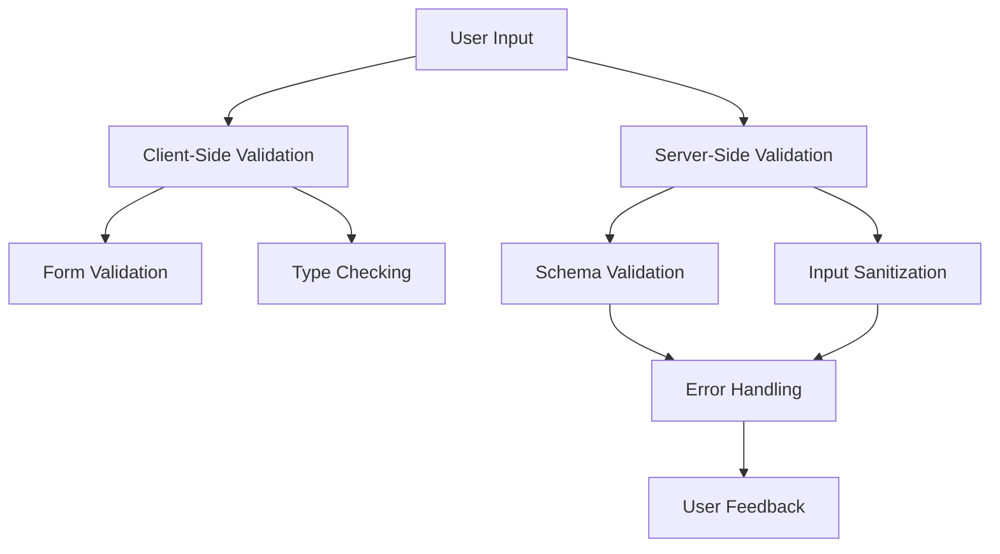
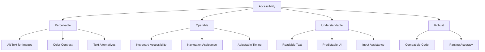

# Security & Best Practices

This document outlines the security best practices and accessibility guidelines implemented in the ImpossibleAgent project.

## Input Validation

### Overview
Input validation is a critical security practice that ensures all data received from external sources is properly checked before processing. This helps prevent injection attacks, data corruption, and unexpected application behavior.

### Implementation Approach

### Key Principles
1. **Defense in Depth**: Implement validation at multiple layers (client, server, database)
2. **Positive Validation**: Validate against known good patterns rather than trying to block known bad patterns
3. **Strong Typing**: Use TypeScript's type system to enforce data structure and types
4. **Sanitization**: Clean and normalize inputs to prevent injection attacks
5. **Comprehensive Error Handling**: Provide clear error messages for invalid inputs

### Implementation Details
1. **Client-Side Validation**:
   - Form validation using React Hook Form
   - Type checking with TypeScript
   - Real-time feedback for users

2. **Server-Side Validation**:
   - Schema validation for all API inputs
   - Parameter type checking and constraints
   - Request body validation

3. **Input Sanitization**:
   - HTML sanitization for user-generated content
   - SQL parameter binding to prevent injection
   - Encoding of special characters

4. **Error Handling**:
   - Standardized error responses
   - Detailed validation error messages
   - Graceful degradation on validation failures

### Edge Cases
- Empty inputs
- Extremely large inputs
- Special characters and Unicode
- Malformed JSON or data structures
- Unexpected data types

## Accessibility

### Overview
Accessibility ensures that applications are usable by people with disabilities, including visual, auditory, physical, speech, cognitive, and neurological disabilities. Following WCAG guidelines helps create an inclusive user experience.

### Implementation Approach

### Key Principles (WCAG 2.1)
1. **Perceivable**: Information and user interface components must be presentable to users in ways they can perceive
2. **Operable**: User interface components and navigation must be operable
3. **Understandable**: Information and the operation of the user interface must be understandable
4. **Robust**: Content must be robust enough to be interpreted by a wide variety of user agents, including assistive technologies

### Implementation Details
1. **Semantic HTML**:
   - Using appropriate HTML elements for their intended purpose
   - Proper heading structure (h1-h6)
   - ARIA roles and attributes where necessary

2. **Keyboard Navigation**:
   - All interactive elements are keyboard accessible
   - Focus indicators are visible
   - Logical tab order

3. **Color and Contrast**:
   - Minimum contrast ratio of 4.5:1 for normal text
   - Not relying on color alone to convey information
   - High contrast mode support

4. **Screen Reader Support**:
   - Alt text for images
   - ARIA labels for interactive elements
   - Descriptive link text

5. **Responsive Design**:
   - Content reflows at different zoom levels
   - Support for text resizing up to 200%
   - Mobile-friendly interfaces

### Testing Approach
- Automated accessibility testing with axe-core
- Manual testing with screen readers (NVDA, VoiceOver)
- Keyboard-only navigation testing
- Color contrast verification
