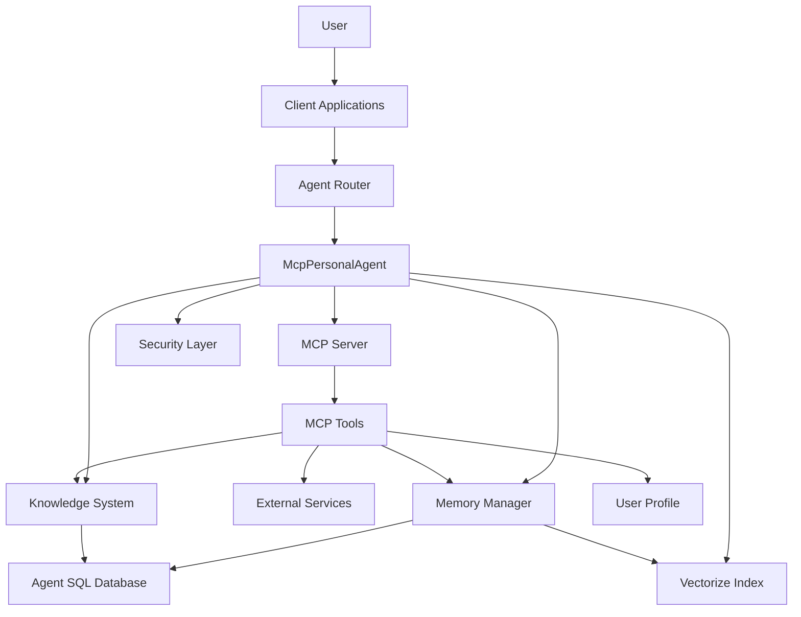

# ImpossibleAgent System Patterns

## System Architecture

ImpossibleAgent follows a layered architecture built on the Cloudflare Agents SDK, with clear separation of concerns between components:



### Core Architectural Layers

1. **Agent Layer**: Extends the SDK's `McpAgent` class to provide the core agent functionality with MCP capabilities
2. **Memory Layer**: Manages episodic and semantic memories with embedding-based retrieval using Vectorize
3. **MCP Server Layer**: Handles tool registration, discovery, and execution through the built-in MCP server
4. **Knowledge Layer**: Extracts and organizes knowledge from conversations
5. **Security Layer**: Manages access control, privacy, and audit logging
6. **Client Layer**: Provides cross-platform user interfaces using SDK's React hooks
7. **Workflow Layer**: Handles complex, multi-step operations using Cloudflare Workflows

## Key Technical Decisions

### 1. Cloudflare Agents SDK as Foundation

**Decision**: Build on the Cloudflare Agents SDK rather than creating a custom agent framework.

**Rationale**:
- Leverages built-in WebSocket communication with Hibernation support
- Provides state management and SQL database capabilities
- Offers tool integration system with standardized patterns
- Includes React hooks for client applications
- Handles agent routing and session management
- Supports MCP server functionality for tool integration

**Implementation Pattern**:
- Extend the `McpAgent` class for our `PersonalAgent` to leverage MCP capabilities
- Use SDK's `this.sql` for database operations with tagged template literals
- Leverage SDK's `this.setState` and `this.state` for state management
- Utilize SDK's tool system for external integrations
- Implement WebSocket Hibernation for efficient resource usage
- Use Workflows for complex, multi-step operations

### 2. SQL Query Implementation with Cloudflare Agent SDK

**Decision**: Use SQL tagged template literals for database operations with the Cloudflare Agent SDK.

**Rationale**:
- The Cloudflare Agent SDK requires a specific approach to SQL queries
- Tagged template literals provide proper parameter binding and SQL injection protection
- Direct use of `sql` tagged template literals is more reliable than prepare/bind pattern
- Proper implementation prevents "near '?': syntax error at offset 0" errors

**Implementation Pattern**:
- Use the `sql` tagged template literal directly for queries
- Properly interpolate parameters within the template literal
- Build dynamic conditions using string concatenation with proper parameter binding
- Avoid using the prepare/bind pattern which can cause syntax errors with the SDK
- Implement proper pagination for large result sets
- Add appropriate indexes for common query patterns

**Example**:
```typescript
// CORRECT: Using SQL tagged template literals directly
const memories = await this.agent.sql`
  SELECT * FROM memories 
  WHERE user_id = ${userId} 
  AND timestamp > ${startDate}
  ORDER BY timestamp DESC
  LIMIT 10
`;

// INCORRECT: Using prepare/bind pattern (causes errors)
const query = this.agent.prepare(`
  SELECT * FROM memories 
  WHERE user_id = ? 
  AND timestamp > ?
  ORDER BY timestamp DESC
  LIMIT 10
`);
const memories = query.bind(userId, startDate).all();
```

### 3. Multi-Layered Memory Architecture with Vectorize Integration

**Decision**: Implement a sophisticated memory system with multiple types of memory and retrieval mechanisms, leveraging Cloudflare Vectorize for embedding storage and retrieval.

**Rationale**:
- Different types of information require different storage and retrieval approaches
- Vectorize provides efficient storage and retrieval of embeddings for semantic search
- Temporal context improves relevance of retrieved memories
- Learning-enhanced retrieval adapts to user patterns
- Vectorize integration improves performance and scalability

**Implementation Pattern**:
- `MemoryManager` as the central coordinator for all memory operations
- `EmbeddingManager` integrated with Cloudflare Vectorize for vector embeddings and semantic search
- `TemporalContextManager` for time-based context and recency weighting
- `RelevanceRanking` for multi-factor relevance scoring with customizable weights
- `LearningEnhancedMemoryRetrieval` for adaptive retrieval based on user patterns
- Batch processing for memory operations to improve performance
- Caching strategies for frequently accessed memories

**Database Schema**:
- `episodic_memories` table for specific events and interactions
  - Fields: id, timestamp, content, importance, context, source, metadata
- `semantic_memories` table for general facts and knowledge
  - Fields: id, fact, confidence, first_observed, last_confirmed, metadata
- `memory_connections` table for relationships between memories
  - Fields: id, source_id, target_id, relationship, strength, created_at, metadata
- Vectorize index for storing embeddings with metadata linking back to SQL records

### 4. MCP Server Implementation

**Decision**: Leverage the built-in MCP server capabilities of the Cloudflare Agents SDK through the `McpAgent` class.

**Rationale**:
- Official SDK provides built-in support for MCP through the `McpAgent` class
- Built-in MCP server simplifies tool registration and execution
- Standardized parameter validation with Zod schemas
- Proper transport methods (SSE and Streamable HTTP) for client compatibility
- Integrated with agent's state management and database

**Implementation Pattern**:
- Extend `McpAgent` class for our `PersonalAgent` to leverage built-in MCP capabilities
- Create an MCP server instance with `new McpServer()` in the agent
- Register tools with `server.tool()` using Zod schemas for parameter validation
- Implement both SSE and Streamable HTTP transport methods in server.ts
- Use proper authentication and authorization for MCP tools
- Implement standardized error handling for MCP operations

**Key Components**:
- MCP server configuration in wrangler.jsonc
- Tool registration in the agent's `init()` method
- Parameter validation with Zod schemas
- Response formatting following MCP specifications
- Transport method implementation in server.ts
- Usage tracking and analytics

### 5. Knowledge Graph System

**Decision**: Implement a graph-based knowledge representation system with Vectorize integration.

**Rationale**:
- Graph structure naturally represents knowledge relationships
- Enables complex queries across related information
- Supports contradiction detection and resolution
- Provides foundation for reasoning capabilities
- Vectorize integration improves semantic search capabilities

**Implementation Pattern**:
- `KnowledgeGraph` as the central component for knowledge representation
- `KnowledgeExtractor` for extracting knowledge from conversations
- `EntityManager` for creating, updating, and querying entities
- `RelationshipManager` for managing connections between entities
- `ContradictionManager` for detecting and resolving conflicts
- Vectorize integration for semantic entity search
- Batch processing for knowledge operations

**Database Schema**:
- `entities` table for storing knowledge entities
  - Fields: id, type, name, properties, confidence, created_at, updated_at
- `relationships` table for connections between entities
  - Fields: id, source_id, target_id, type, properties, confidence, created_at
- `contradictions` table for tracking conflicting information
  - Fields: id, entity_id, property, value1, value2, resolution, confidence
- Vectorize index for entity embeddings with metadata linking back to SQL records

### 6. Testing Pyramid Pattern

**Decision**: Implement a balanced testing approach following the Testing Pyramid Pattern.

**Rationale**:
- Balanced testing at different levels improves reliability and performance
- Unit tests provide fast feedback on individual components
- Integration tests verify component interactions
- End-to-end tests validate critical user journeys

**Implementation Pattern**:
- **Unit Tests**: Focus on testing individual functions, methods, and classes in isolation
  - Fast execution (milliseconds per test)
  - High isolation (dependencies are mocked)
  - High coverage (aim for >85% of business logic)
  - Test both success and error paths
  
- **Integration Tests**: Verify that different components work together correctly
  - Medium execution speed (hundreds of milliseconds per test)
  - Partial isolation (some real dependencies, some mocked)
  - Medium coverage (aim for critical integration points)
  - Test component interactions and data flow
  
- **End-to-End Tests**: Validate complete user journeys
  - Slow execution (seconds per test)
  - No isolation (real system components)
  - Low coverage (focus on critical user journeys only)
  - Test complete user flows

**Coverage Targets**:
- Critical Components (90-100%): Memory system, knowledge graph, tool integration, security, error handling
- Standard Components (85-90%): API routes, data transformation, configuration, utilities
- Lower Priority Components (70-85%): Development utilities, logging, documentation generation

**CI/CD Integration**:
- Automated testing in CI/CD pipeline
- Test coverage reporting
- Performance benchmarking
- Regression testing

### 7. Centralized Error Handling

**Decision**: Implement a centralized error handling system in src/utils/errors.ts.

**Rationale**:
- Centralized approach improves consistency and maintainability
- Standardized error formatting improves debugging
- Proper error classification helps with appropriate responses
- Follows global rule to "centralize all error handling in src/utils/errors.ts"

**Implementation Pattern**:
- `AppError` as the base error class with standardized properties
- Specialized error classes for different error types
- Utility functions for common error scenarios
- Standardized error formatting and logging
- Wrappers for database operations, external services, and tool execution
- Retry mechanisms for transient failures
- Telemetry for error tracking and analysis

**Key Components**:
- Error class hierarchy with specialized error types
- Error formatting and logging utilities
- Safe execution wrappers with error handling
- Timeout handling for asynchronous operations
- Client-facing error handling with appropriate messages
- Error telemetry for tracking and analysis

### 8. WebSocket Hibernation Implementation

**Decision**: Implement WebSocket Hibernation for efficient resource usage.

**Rationale**:
- Hibernation allows the agent to sleep during inactive periods
- Preserves state and connection while reducing resource usage
- Improves scalability for many concurrent connections
- Better handling of connection interruptions

**Implementation Pattern**:
- Use `this.ctx.acceptWebSocket(server)` instead of the legacy `server.accept()` approach
- Implement proper `webSocketMessage`, `webSocketClose`, and `webSocketError` handlers
- Ensure proper state management during hibernation periods
- Add reconnection handling for clients

**Key Components**:
- WebSocket connection handling with hibernation support
- State preservation during hibernation
- Reconnection handling for clients
- Proper error handling for WebSocket connections

### 9. Workflow Implementation for Complex Operations

**Decision**: Implement Cloudflare Workflows for complex, multi-step operations.

**Rationale**:
- Workflows provide a structured approach to complex operations
- Enable asynchronous processing of long-running tasks
- Improve reliability with built-in retry mechanisms
- Support human-in-the-loop interactions

**Implementation Pattern**:
- Extend `WorkflowEntrypoint` class for workflow definitions
- Implement `run` method with step-based execution
- Use `step.do` for individual workflow steps
- Configure retry strategies for transient failures
- Implement sleep periods for time-based operations
- Add workflow bindings in wrangler.jsonc

**Key Components**:
- Workflow class definitions for complex operations
- Step-based execution with proper error handling
- Retry strategies for transient failures
- Integration with the agent for workflow triggering
- Status tracking and reporting

### 10. Security System

**Decision**: Implement a comprehensive security system with access control, audit logging, and privacy settings.

**Rationale**:
- Rule-based access control provides flexible security
- Audit logging enables security monitoring and compliance
- User-specific privacy settings improve trust and control
- Data retention policies help manage storage and privacy
- Proper encryption protects sensitive information

**Implementation Pattern**:
- `SecurityManager` as the central component for security operations
- Rule-based access control with resource, action, and role parameters
- Priority-based rule evaluation for fine-grained control
- Comprehensive audit logging for security events
- User-specific privacy settings with configurable options
- Data encryption for sensitive information
- Proper password hashing with bcrypt or Argon2
- Multi-factor authentication support

**Database Schema**:
- `access_control_rules` table for storing access control rules
  - Fields: id, resource, action, role, condition, priority, effect, created_at
- `audit_log` table for security event logging
  - Fields: id, event_type, user_id, resource, action, result, timestamp, metadata
- `privacy_settings` table for user privacy preferences
  - Fields: id, user_id, setting_key, setting_value, updated_at
- `authentication_factors` table for multi-factor authentication
  - Fields: id, user_id, factor_type, factor_data, enabled, created_at, updated_at

### 11. MCP Server Transport Implementation

**Decision**: Implement both SSE and Streamable HTTP transport methods for MCP server functionality.

**Rationale**:
- Supporting both transport methods ensures compatibility with all MCP clients
- SSE is currently supported by most remote MCP clients
- Streamable HTTP is the future standard for MCP transport
- Proper routing and authentication improve security and reliability

**Implementation Pattern**:
- Update server.ts to handle both transport methods
- Implement proper routing for MCP endpoints
- Add support for authentication and authorization
- Configure CORS and other security settings
- Use the `McpAgent` class for MCP server functionality

**Key Components**:
- SSE endpoint for current MCP clients
- Streamable HTTP endpoint for future compatibility
- Authentication and authorization for MCP tools
- CORS configuration for cross-origin requests
- Error handling for MCP operations

## McpPersonalAgent Implementation Pattern

The `McpPersonalAgent` class has been implemented as of May 11, 2025, providing a proper MCP implementation using the Cloudflare Agents SDK. This implementation follows the best practices identified in our Cloudflare Agents documentation review and serves as a foundation for our agent's functionality with enhanced memory capabilities, personalization features, and MCP capabilities.

### Implementation Overview

The McpPersonalAgent extends the `McpAgent` class from the Cloudflare Agents SDK, replacing our previous implementation that extended `AIChatAgent`. This change enables proper MCP (Model Context Protocol) capabilities, allowing the agent to provide standardized tools that can be used by MCP clients.

```typescript
import { McpAgent } from "agents/mcp";
import { McpServer } from "@modelcontextprotocol/sdk/server/mcp.js";
import { z } from "zod";
import { OpenAI } from "openai";

// Define interfaces for the agent's state
interface UserProfile {
  name?: string;
  interests?: string[];
  importantDates?: { description: string; date: string }[];
  firstInteraction?: string;
}

interface UserPreferences {
  theme: "light" | "dark";
  notificationPreferences: {
    email: boolean;
    push: boolean;
  };
  privacySettings: {
    shareData: boolean;
    storeHistory: boolean;
  };
}

interface ConversationEntry {
  id: string;
  messages: any[];
  context: string;
  timestamp: number;
}

// Define the state interface for the McpPersonalAgent
interface McpPersonalAgentState {
  conversations: ConversationEntry[];
  userProfile: UserProfile;
  preferences: UserPreferences;
  lastActive: string;
  messages: any[];
}

/**
 * McpPersonalAgent extends McpAgent to provide a persistent, personalized AI companion
 * with enhanced memory capabilities, personalization features, and MCP capabilities.
 */
export class McpPersonalAgent extends McpAgent<Env, McpPersonalAgentState> {
  // Create an MCP server instance
  server = new McpServer({
    name: "personal-agent",
    version: "1.0.0",
    description: "A personal AI companion with persistent memory and enhanced capabilities"
  });

  // Initial state with default values
  initialState: McpPersonalAgentState = {
    conversations: [],
    userProfile: {
      firstInteraction: new Date().toISOString()
    },
    preferences: {
      theme: "dark",
      notificationPreferences: { email: false, push: true },
      privacySettings: { shareData: false, storeHistory: true }
    },
    lastActive: new Date().toISOString(),
    messages: []
  };

  // Initialize the agent with necessary database tables and MCP tools
  async init() {
    // Create database schema
    await this.sql`
      CREATE TABLE IF NOT EXISTS episodic_memories (
        id TEXT PRIMARY KEY,
        timestamp INTEGER NOT NULL,
        content TEXT NOT NULL,
        importance INTEGER DEFAULT 5,
        context TEXT,
        source TEXT,
        metadata TEXT
      )
    `;
    
    // Create indexes for better performance
    await this.sql`CREATE INDEX IF NOT EXISTS idx_episodic_timestamp ON episodic_memories(timestamp)`;
    
    // Register MCP tools
    this.registerMcpTools();
  }

  // Register MCP tools with the server
  private registerMcpTools() {
    // Memory management tools
    this.server.tool(
      "store_memory",
      "Store a new memory in the agent's database",
      {
        content: z.string().describe("The content of the memory to store"),
        importance: z.number().min(1).max(10).optional().describe("The importance of the memory (1-10)"),
        context: z.string().optional().describe("The context in which the memory was created"),
        source: z.string().optional().describe("The source of the memory")
      },
      async ({ content, importance, context, source }) => {
        const result = await this.storeEpisodicMemory({
          content,
          importance,
          context,
          source
        });
        
        return {
          content: [
            { 
              type: "text", 
              text: `Memory stored successfully with ID: ${result.id}` 
            }
          ]
        };
      }
    );

    // Knowledge graph tools
    this.server.tool(
      "query_knowledge_graph",
      "Query the knowledge graph for entities and relationships",
      {
        entityTypes: z.array(z.string()).optional().describe("Types of entities to query"),
        entityNames: z.array(z.string()).optional().describe("Names of entities to query"),
        relationshipTypes: z.array(z.string()).optional().describe("Types of relationships to query"),
        minConfidence: z.number().min(0).max(1).optional().describe("Minimum confidence score (0-1)"),
        limit: z.number().min(1).max(100).optional().describe("Maximum number of results to return")
      },
      async ({ entityTypes, entityNames, relationshipTypes, minConfidence, limit = 20 }) => {
        // Implementation for knowledge graph querying
        // ...
      }
    );

    // User profile tools
    this.server.tool(
      "update_user_profile",
      "Update user profile information",
      {
        name: z.string().optional().describe("User's name"),
        interests: z.array(z.string()).optional().describe("User's interests"),
        importantDates: z.array(
          z.object({
            description: z.string(),
            date: z.string()
          })
        ).optional().describe("Important dates to remember")
      },
      async ({ name, interests, importantDates }) => {
        // Implementation for updating user profile
        // ...
      }
    );
  }

  // Process a chat message and generate a response
  async processChat(message: string): Promise<{ content: string }> {
    try {
      // Update last active timestamp
      this.setState
