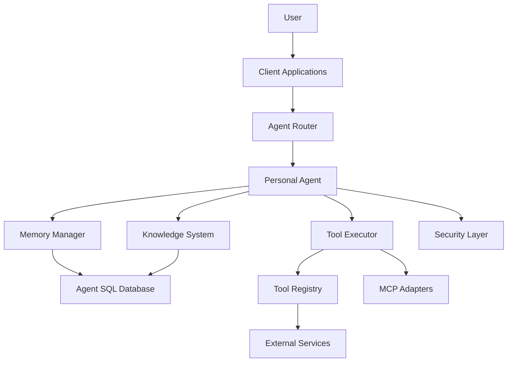

# ImpossibleAgent System Patterns

## System Architecture

ImpossibleAgent follows a layered architecture built on the Cloudflare Agents SDK, with clear separation of concerns between components:

### Core Architectural Layers

1. **Agent Layer**: Extends the SDK's `AIChatAgent` class to provide the core agent functionality
2. **Memory Layer**: Manages episodic and semantic memories with embedding-based retrieval
3. **Tool Layer**: Handles tool discovery, suggestion, and execution through MCP adapters
4. **Knowledge Layer**: Extracts and organizes knowledge from conversations
5. **Security Layer**: Manages access control, privacy, and audit logging
6. **Client Layer**: Provides cross-platform user interfaces using SDK's React hooks

## Key Technical Decisions

### 1. Cloudflare Agents SDK as Foundation

**Decision**: Build on the Cloudflare Agents SDK rather than creating a custom agent framework.

**Rationale**:
- Leverages built-in WebSocket communication
- Provides state management and SQL database capabilities
- Offers tool integration system with standardized patterns
- Includes React hooks for client applications
- Handles agent routing and session management

**Implementation Pattern**:
- Extend the `AIChatAgent` class for our `PersonalAgent`
- Use SDK's `this.sql` for database operations
- Leverage SDK's `this.setState` and `this.state` for state management
- Utilize SDK's tool system for external integrations

### 2. Multi-Layered Memory Architecture

**Decision**: Implement a sophisticated memory system with multiple types of memory and retrieval mechanisms.

**Rationale**:
- Different types of information require different storage and retrieval approaches
- Embedding-based retrieval enables semantic search
- Temporal context improves relevance of retrieved memories
- Learning-enhanced retrieval adapts to user patterns

**Implementation Pattern**:
- `MemoryManager` as the central coordinator for all memory operations
- `EmbeddingManager` for vector embeddings and semantic search capabilities
- `TemporalContextManager` for time-based context and recency weighting
- `RelevanceRanking` for multi-factor relevance scoring with customizable weights
- `LearningEnhancedMemoryRetrieval` for adaptive retrieval based on user patterns

**Database Schema**:
- `episodic_memories` table for specific events and interactions
  - Fields: id, timestamp, content, importance, context, source, metadata
- `semantic_memories` table for general facts and knowledge
  - Fields: id, fact, confidence, first_observed, last_confirmed, metadata
- `memory_connections` table for relationships between memories
  - Fields: id, source_id, target_id, relationship, strength, created_at, metadata

### 3. Tool Integration Framework

**Decision**: Implement a flexible tool integration framework using the MCP adapter pattern.

**Rationale**:
- Standardized adapter pattern simplifies tool integration
- Clear separation between tool discovery, suggestion, and execution
- Context-aware suggestions improve user experience
- Usage tracking provides valuable insights for suggestions

**Implementation Pattern**:
- `BaseMCPAdapter` with standardized interfaces for all tool integrations
- `ToolDiscoveryManager` for registering and discovering available tools
- `ToolSuggestionSystem` for context-aware tool suggestions
- `ToolUsageTracker` for comprehensive analytics and tracking
- `ToolExecutor` for handling tool execution and result processing

**Key Components**:
- Tool registration and discovery system
- Context-aware suggestion algorithm
- Parameter handling for tool execution
- Result formatting and presentation
- Usage tracking and analytics

### 4. Knowledge Graph System

**Decision**: Implement a graph-based knowledge representation system.

**Rationale**:
- Graph structure naturally represents knowledge relationships
- Enables complex queries across related information
- Supports contradiction detection and resolution
- Provides foundation for reasoning capabilities

**Implementation Pattern**:
- `KnowledgeGraph` as the central component for knowledge representation
- `KnowledgeExtractor` for extracting knowledge from conversations
- `EntityManager` for creating, updating, and querying entities
- `RelationshipManager` for managing connections between entities
- `ContradictionManager` for detecting and resolving conflicts

**Database Schema**:
- `entities` table for storing knowledge entities
  - Fields: id, type, name, properties, confidence, created_at, updated_at
- `relationships` table for connections between entities
  - Fields: id, source_id, target_id, type, properties, confidence, created_at
- `contradictions` table for tracking conflicting information
  - Fields: id, entity_id, property, value1, value2, resolution, confidence

### 5. Testing Pyramid Pattern

**Decision**: Implement a balanced testing approach following the Testing Pyramid Pattern.

**Rationale**:
- Balanced testing at different levels improves reliability and performance
- Unit tests provide fast feedback on individual components
- Integration tests verify component interactions
- End-to-end tests validate critical user journeys

**Implementation Pattern**:
- **Unit Tests**: Focus on testing individual functions, methods, and classes in isolation
  - Fast execution (milliseconds per test)
  - High isolation (dependencies are mocked)
  - High coverage (aim for >85% of business logic)
  - Test both success and error paths
  
- **Integration Tests**: Verify that different components work together correctly
  - Medium execution speed (hundreds of milliseconds per test)
  - Partial isolation (some real dependencies, some mocked)
  - Medium coverage (aim for critical integration points)
  - Test component interactions and data flow
  
- **End-to-End Tests**: Validate complete user journeys
  - Slow execution (seconds per test)
  - No isolation (real system components)
  - Low coverage (focus on critical user journeys only)
  - Test complete user flows

**Coverage Targets**:
- Critical Components (90-100%): Memory system, knowledge graph, tool integration, security, error handling
- Standard Components (85-90%): UI logic, API routes, data transformation, configuration, utilities
- Lower Priority Components (70-85%): Development utilities, logging, documentation generation

### 6. Centralized Error Handling

**Decision**: Implement a centralized error handling system in src/utils/errors.ts.

**Rationale**:
- Centralized approach improves consistency and maintainability
- Standardized error formatting improves debugging
- Proper error classification helps with appropriate responses
- Follows global rule to "centralize all error handling in src/utils/errors.ts"

**Implementation Pattern**:
- `AppError` as the base error class with standardized properties
- Specialized error classes for different error types
- Utility functions for common error scenarios
- Standardized error formatting and logging
- Wrappers for database operations, external services, and tool execution

**Key Components**:
- Error class hierarchy with specialized error types
- Error formatting and logging utilities
- Safe execution wrappers with error handling
- Timeout handling for asynchronous operations
- Client-facing error handling with appropriate messages

### 7. Security System

**Decision**: Implement a comprehensive security system with access control, audit logging, and privacy settings.

**Rationale**:
- Rule-based access control provides flexible security
- Audit logging enables security monitoring and compliance
- User-specific privacy settings improve trust and control
- Data retention policies help manage storage and privacy

**Implementation Pattern**:
- `SecurityManager` as the central component for security operations
- Rule-based access control with resource, action, and role parameters
- Priority-based rule evaluation for fine-grained control
- Comprehensive audit logging for security events
- User-specific privacy settings with configurable options

**Database Schema**:
- `access_control_rules` table for storing access control rules
  - Fields: id, resource, action, role, condition, priority, effect, created_at
- `audit_log` table for security event logging
  - Fields: id, event_type, user_id, resource, action, result, timestamp, metadata
- `privacy_settings` table for user privacy preferences
  - Fields: id, user_id, setting_key, setting_value, updated_at
