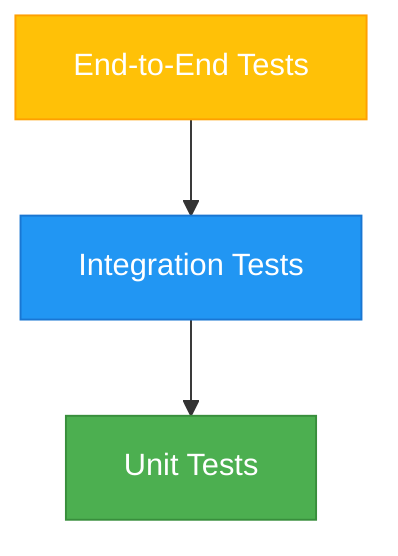

# ImpossibleAgent Testing Strategy

## Overview

This document outlines the comprehensive testing strategy for the ImpossibleAgent project, established on May 9, 2025. The strategy follows the Testing Pyramid Pattern, which emphasizes a balanced approach to testing with a focus on fast, reliable unit tests as the foundation, complemented by integration tests and end-to-end tests.

## Testing Pyramid



### Unit Tests (Foundation)

Unit tests form the foundation of our testing strategy, focusing on testing individual functions, methods, and classes in isolation.

**Characteristics:**
- Fast execution (milliseconds per test)
- High isolation (dependencies are mocked)
- High coverage (aim for >85% of business logic)
- Focused on single units of functionality
- Test both success and error paths

**Implementation:**
- Using Vitest as the test framework
- Mocking dependencies with vi.mock
- Organizing tests to mirror source code structure
- Following the Arrange-Act-Assert pattern
- Using descriptive test names that explain behavior

### Integration Tests (Middle Layer)

Integration tests verify that different components work together correctly, focusing on the interactions between components.

**Characteristics:**
- Medium execution speed (hundreds of milliseconds per test)
- Partial isolation (some real dependencies, some mocked)
- Medium coverage (aim for critical integration points)
- Test component interactions and data flow
- Verify behavior across component boundaries

**Implementation:**
- Using Vitest with minimal mocking
- Testing API routes with database operations
- Verifying component interactions
- Using realistic test data
- Testing with in-memory SQLite for database tests

### End-to-End Tests (Top Layer)

End-to-end tests validate complete user journeys, ensuring that the entire system works together correctly from the user's perspective.

**Characteristics:**
- Slow execution (seconds per test)
- No isolation (real system components)
- Low coverage (focus on critical user journeys only)
- Test complete user flows
- Verify UI interactions and state changes

**Implementation:**
- Using Playwright for browser automation
- Testing critical user journeys
- Verifying UI interactions and state changes
- Testing cross-device functionality
- Running in a controlled test environment

## Test Coverage Targets

We have established tiered coverage targets based on component criticality:

### Critical Components (90-100% coverage)

These components form the core of our system and require the highest level of test coverage:

- Memory system (MemoryManager, EmbeddingManager, etc.)
- Knowledge graph (KnowledgeGraph, KnowledgeExtractor, etc.)
- Tool integration (ToolExecutor, ToolDiscoveryManager, etc.)
- Security system (SecurityManager, access control, etc.)
- Error handling (AppError, error utilities, etc.)

### Standard Components (85-90% coverage)

These components are important but slightly less critical:

- UI logic (React components, hooks, etc.)
- API routes (server endpoints, request handlers, etc.)
- Data transformation (formatters, parsers, etc.)
- Configuration management (settings, preferences, etc.)
- Utility functions (helpers, formatters, etc.)

### Lower Priority Components (70-85% coverage)

These components are less critical or more difficult to test:

- Development utilities (scripts, build tools, etc.)
- Logging (log formatters, log storage, etc.)
- Documentation generation (doc generators, etc.)
- Non-critical UI elements (decorative components, etc.)

## Test-First Development Process

For critical components, we follow a test-first development approach:

1. **Define Requirements**: Clearly define what the component should do
2. **Write Test Cases**: Create tests that verify the expected behavior
3. **Run Tests (Red Phase)**: Verify that tests fail as expected
4. **Implement Feature**: Write the minimum code needed to make tests pass
5. **Run Tests (Green Phase)**: Verify that tests now pass
6. **Refactor**: Improve the implementation while ensuring tests continue to pass
7. **Document**: Document the behavior and any edge cases

## Mocking Strategies

We use various mocking strategies to isolate components during testing:

### Mocking Circular Dependencies

```typescript
// Example of mocking circular dependencies
import { vi } from 'vitest';

// Mock the ToolSuggestionSystem to break circular dependency
vi.mock('../src/tools/ToolSuggestionSystem', () => {
  return {
    ToolSuggestionSystem: vi.fn().mockImplementation(() => ({
      updateSuggestionRankings: vi.fn(),
      initialize: vi.fn().mockResolvedValue(undefined),
      suggestTools: vi.fn().mockResolvedValue([
        { id: 'tool1', name: 'Tool 1', score: 0.9 },
        { id: 'tool2', name: 'Tool 2', score: 0.8 }
      ])
    }))
  };
});
```

### Mocking SQL Database

```typescript
// Example of mocking SQL database
const mockSql = vi.fn().mockImplementation((strings, ...values) => {
  // Check the SQL query and return appropriate mock data
  const query = strings.join('?');
  
  if (query.includes('SELECT * FROM tool_usage_events')) {
    return Promise.resolve({
      rows: [
        { id: 'event1', tool_id: 'tool1', success: true },
        { id: 'event2', tool_id: 'tool2', success: false }
      ]
    });
  }
  
  if (query.includes('CREATE TABLE')) {
    return Promise.resolve({ rows: [] });
  }
  
  return Promise.resolve({ rows: [] });
});

// Use in agent mock
const agent = {
  sql: mockSql,
  setState: vi.fn(),
  state: {}
};
```

### Mocking Time

```typescript
// Example of mocking time
import { vi } from 'vitest';

// Set a fixed time for all tests in this file
vi.useFakeTimers();
const now = new Date('2025-05-09T12:00:00Z');
vi.setSystemTime(now);

// Use in tests
it('should use the current time', () => {
  const timestamp = Date.now();
  expect(timestamp).toBe(now.getTime());
});

// Reset after tests
afterAll(() => {
  vi.useRealTimers();
});
```

### Mocking External Services

```typescript
// Example of mocking external services
import { vi } from 'vitest';

// Mock fetch for external API calls
global.fetch = vi.fn().mockImplementation((url) => {
  if (url.includes('api.weather.com')) {
    return Promise.resolve({
      ok: true,
      json: () => Promise.resolve({
        temperature: 72,
        conditions: 'sunny'
      })
    });
  }
  
  return Promise.resolve({
    ok: false,
    status: 404,
    statusText: 'Not Found'
  });
});
```

## Continuous Integration

We have implemented continuous integration to ensure that tests are run automatically on every commit and pull request:

### GitHub Actions Workflow

```yaml
name: Test

on:
  push:
    branches: [ main ]
  pull_request:
    branches: [ main ]

jobs:
  test:
    runs-on: ubuntu-latest
    
    steps:
    - uses: actions/checkout@v3
    
    - name: Setup Node.js
      uses: actions/setup-node@v3
      with:
        node-version: '18'
        cache: 'npm'
    
    - name: Install dependencies
      run: npm ci
    
    - name: Run tests
      run: npm test
    
    - name: Generate coverage report
      run: npm run test:coverage
    
    - name: Upload coverage report
      uses: codecov/codecov-action@v3
      with:
        token: ${{ secrets.CODECOV_TOKEN }}
        file: ./coverage/coverage-final.json
        fail_ci_if_error: true
```

### Coverage Reporting

We use Vitest's built-in coverage reporting capabilities to track test coverage:

```json
// vitest.config.ts
import { defineConfig } from 'vitest/config';

export default defineConfig({
  test: {
    environment: 'node',
    coverage: {
      provider: 'v8',
      reporter: ['text', 'json', 'html'],
      exclude: [
        'node_modules/',
        'test/',
        '**/*.d.ts',
        '**/*.test.ts',
        '**/*.config.ts'
      ],
      thresholds: {
        statements: 85,
        branches: 80,
        functions: 85,
        lines: 85
      }
    }
  }
});
```

## Testing Best Practices

### 1. Test Independence

Each test should be independent of others:

- Reset state between tests
- Avoid test order dependencies
- Use beforeEach to set up test environment
- Use afterEach to clean up after tests

### 2. Test Readability

Use clear, descriptive test names and the Arrange-Act-Assert pattern:

```typescript
it('should return user-specific tool recommendations based on usage history', async () => {
  // Arrange
  const userId = 'test-user';
  const mockUsageData = [/* mock data */];
  mockSql.mockResolvedValueOnce({ rows: mockUsageData });
  
  // Act
  const recommendations = await toolUsageTracker.getRecommendationsForUser(userId);
  
  // Assert
  expect(recommendations).toHaveLength(3);
  expect(recommendations[0].toolId).toBe('most-used-tool');
  expect(recommendations[0].score).toBeGreaterThan(0.8);
});
```

### 3. Test Reliability

Avoid flaky tests with deterministic test data:

- Use fixed timestamps with vi.useFakeTimers()
- Seed random number generators
- Mock external dependencies
- Use stable test data

### 4. Test Maintenance

Keep tests up to date with implementation changes:

- Update tests when implementation changes
- Refactor tests alongside code refactoring
- Use abstractions to minimize test changes
- Document test assumptions

### 5. Test Performance

Keep tests fast to encourage frequent running:

- Minimize slow operations in unit tests
- Use mocks for external dependencies
- Run slow tests separately
- Optimize test setup and teardown

## Test Documentation

### Test File Naming Conventions

- Unit tests: `[filename].test.ts`
- Integration tests: `[filename].integration.test.ts`
- End-to-end tests: `[filename].e2e.test.ts`

### Test Organization

- Group related tests with describe blocks
- Use nested describe blocks for sub-features
- Use it blocks for individual test cases
- Use clear, descriptive test names

### Test Documentation Comments

- Document test assumptions
- Explain complex test setups
- Document edge cases being tested
- Explain the purpose of mocks and stubs

## Implementation Plan

### Phase 1: Foundation (Current)

- Establish testing strategy and documentation
- Set up testing infrastructure (Vitest, Playwright)
- Implement unit tests for critical components
- Set up continuous integration

### Phase 2: Expansion (June 2025)

- Increase unit test coverage to meet targets
- Implement integration tests for key components
- Develop UI component testing strategy
- Implement end-to-end tests for critical user journeys

## UI Component Testing Strategy

To ensure the quality of our emotionally engaging UI architecture, we've developed a specialized testing approach for the new UI components:

### Lifeline Interface Testing

**Unit Tests:**
- Test node rendering with different data types
- Verify timeline navigation functionality
- Test zoom and filtering capabilities
- Validate topic clustering algorithms
- Test AI-generated future nodes

**Integration Tests:**
- Verify integration with Memory Manager
- Test interaction with Chat Interface
- Validate data flow from agent state to visualization

**Visual Regression Tests:**
- Capture screenshots of different timeline states
- Compare visual appearance across browsers
- Verify responsive behavior at different screen sizes

### Companion Avatar Testing

**Unit Tests:**
- Test mood detection algorithms
- Verify animation state transitions
- Validate color and form changes based on context
- Test customization options

**Integration Tests:**
- Verify integration with sentiment analysis
- Test reaction to user input and tool execution
- Validate synchronization across devices

**Visual Regression Tests:**
- Capture avatar animations in different states
- Verify smooth transitions between states
- Test performance on low-end devices

### Memory Garden Testing

**Unit Tests:**
- Test 3D object rendering
- Verify navigation controls
- Test interaction with garden elements
- Validate data binding to visual elements

**Integration Tests:**
- Verify integration with Memory Manager
- Test interaction with Lifeline Interface
- Validate data flow from agent state to visualization

**Performance Tests:**
- Measure frame rate with different numbers of elements
- Test memory usage during navigation
- Verify loading times on different devices

### Memory Garden Lite (2D) Testing

**Unit Tests:**
- Test 2D element rendering
- Verify CSS/SVG animation functionality
- Test interaction with garden elements
- Validate data binding to visual elements

**Integration Tests:**
- Verify integration with Memory Manager
- Test interaction with Lifeline Interface
- Validate data flow from agent state to visualization

**Performance Tests:**
- Measure rendering performance on low-end devices
- Test animation smoothness across browsers
- Verify loading times on mobile devices

### Voice Interaction Testing

**Unit Tests:**
- Test speech recognition accuracy
- Verify text-to-speech functionality
- Test command parsing algorithms
- Validate visual feedback components

**Integration Tests:**
- Verify integration with Chat Interface
- Test interaction with Companion Avatar
- Validate command execution flow

**Accessibility Tests:**
- Test with screen readers
- Verify keyboard navigation
- Test with different voice patterns and accents
- Validate multi-language support

### Proactive Check-In Testing

**Unit Tests:**
- Test trigger mechanisms
- Verify notification rendering
- Test user control functionality
- Validate context-awareness algorithms

**Integration Tests:**
- Verify integration with Memory Manager
- Test interaction with Companion Avatar
- Validate integration with Chat Interface

**User Experience Tests:**
- Measure user response to different check-in types
- Test frequency and timing algorithms
- Verify non-intrusiveness of notifications

### Simplified Mode Testing

**Unit Tests:**
- Test component visibility toggling
- Verify onboarding flow functionality
- Test mode switching mechanism
- Validate progressive disclosure logic

**Integration Tests:**
- Verify integration with user preferences
- Test persistence across sessions
- Validate data access in different modes

**Usability Tests:**
- Test with non-technical users
- Measure task completion rates
- Verify intuitive understanding of interface

### Ritual Moments Testing

**Unit Tests:**
- Test trigger mechanisms
- Verify animation rendering
- Test integration with timeline events
- Validate special interface modes

**Integration Tests:**
- Verify integration with Memory Explorer
- Test interaction with Companion Avatar
- Validate data flow from agent state to visualization

**Emotional Impact Tests:**
- Measure user emotional response to different rituals
- Test timing and frequency algorithms
- Verify memorability of special moments

### Tool Usage Analytics Dashboard Testing

**Unit Tests:**
- Test chart rendering with different data sets
- Verify filtering and sorting functionality
- Test data aggregation algorithms
- Validate interactive elements

**Integration Tests:**
- Verify integration with Tool Usage Tracker
- Test data flow from usage events to visualization
- Validate real-time updates

**Performance Tests:**
- Measure rendering performance with large data sets
- Test responsiveness of interactive elements
- Verify loading times with different amounts of data

### User Testing Phase (June 1-10, 2025)

A dedicated user testing phase will be conducted to gather feedback on the emotional features:

**Testing Focus:**
- Emotional engagement with Companion Avatar
- Narrative experience of Lifeline Interface
- Immersive quality of Memory Garden
- Effectiveness of Ritual Moments
- Usefulness of Proactive Check-In System
- Accessibility of Simplified Mode
- Natural feel of Voice Interaction

**Testing Methods:**
- Guided user sessions with task completion
- Emotional response surveys
- Eye-tracking for engagement measurement
- Long-term usage tracking (7-day period)
- Comparative testing against traditional interfaces
- Accessibility testing with diverse user groups

**Success Metrics:**
- Emotional connection score (survey-based)
- Task completion rates compared to traditional interfaces
- Feature discovery and usage rates
- User retention and engagement metrics
- Qualitative feedback on emotional experience
